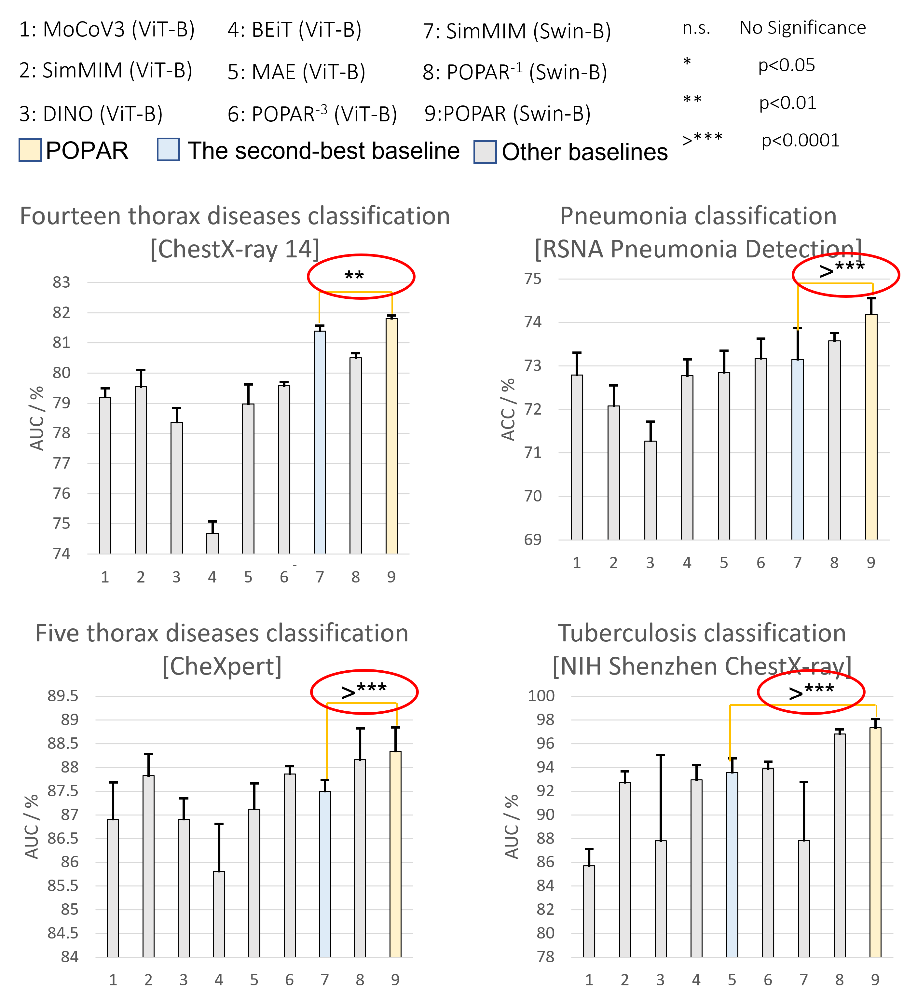
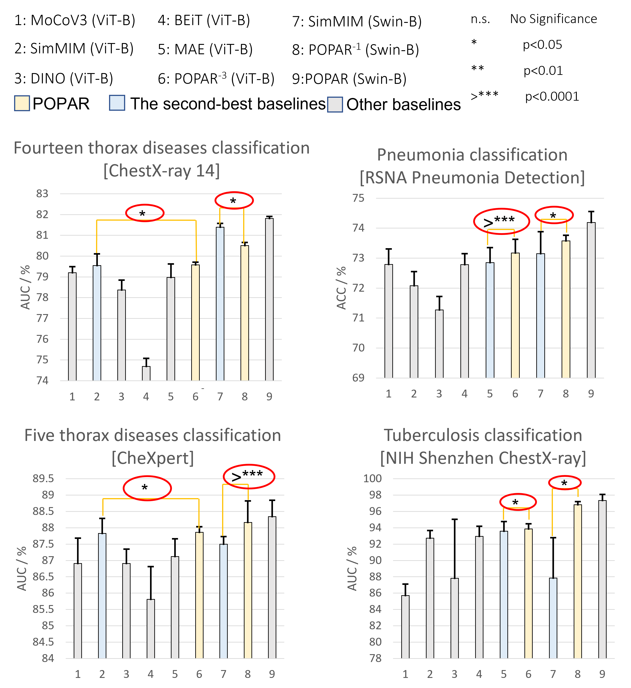
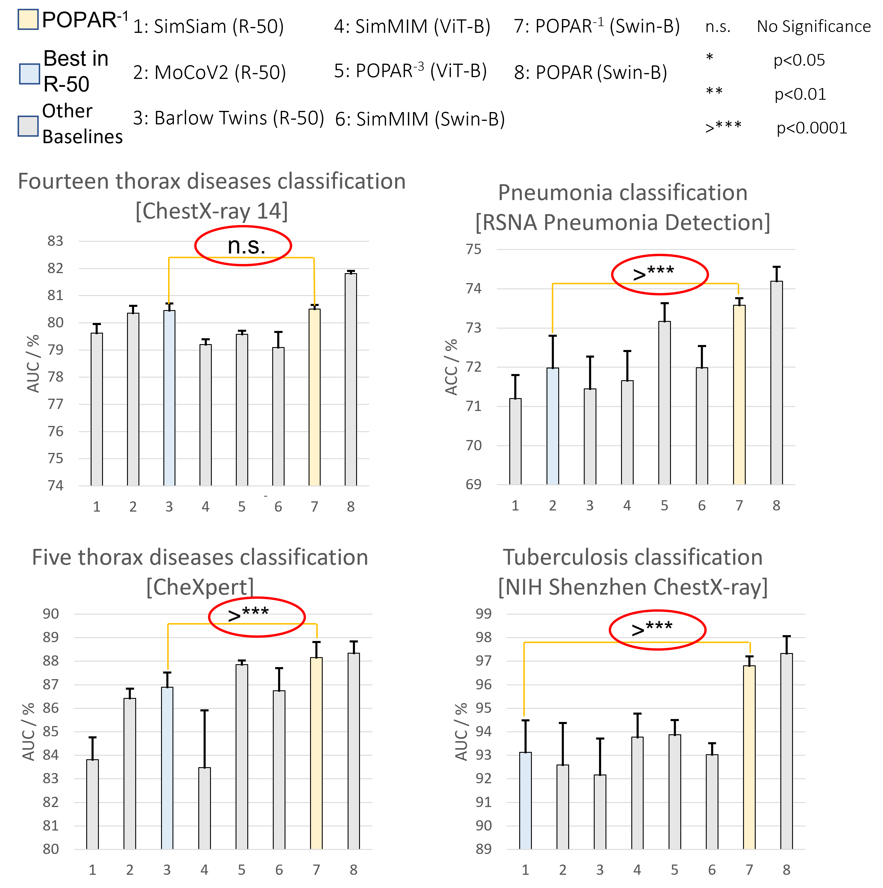
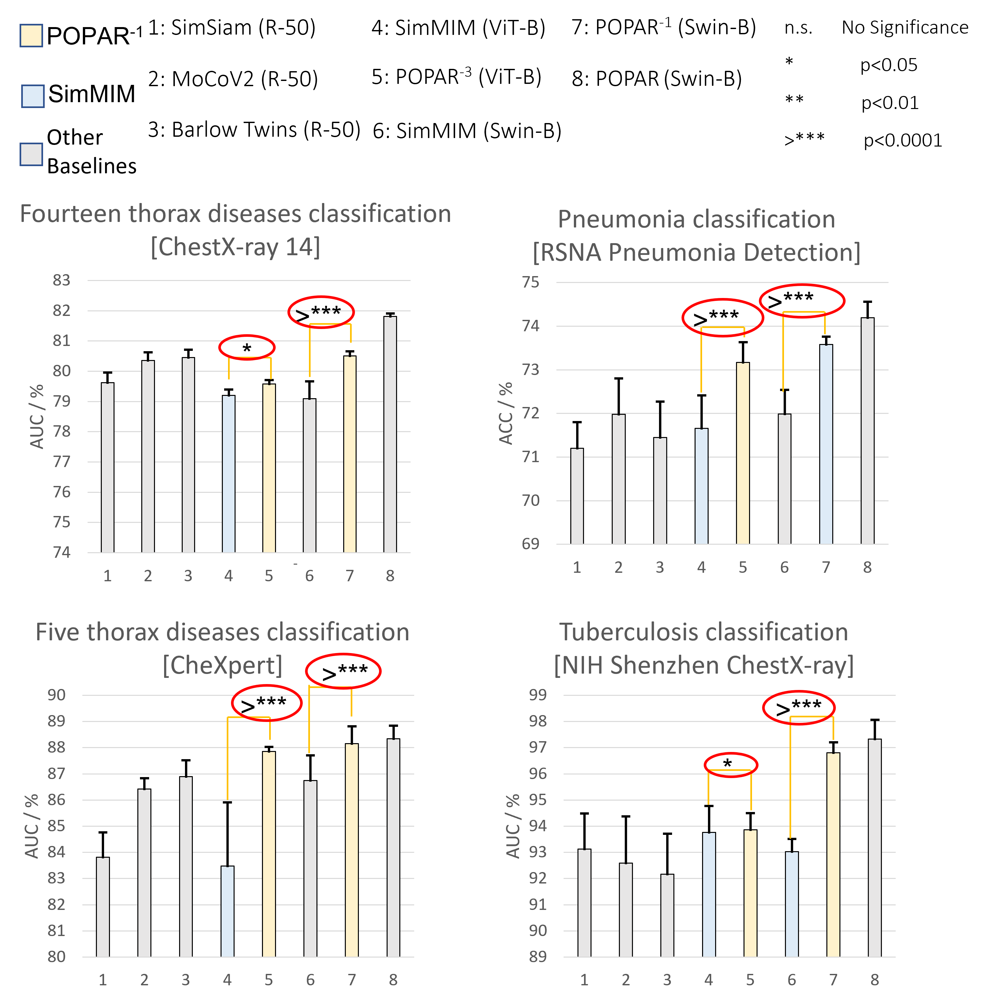
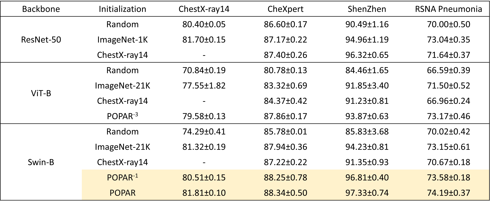

# POPAR: Patch Order Prediction and Appearance Recovery for Self-supervised Medical Image Analysis
This repository provides a PyTorch implementation of the POPAR: Patch Order Prediction and Appearance Recovery for Self-supervised Medical Image Analysis.

We propose POPAR (patch order prediction and appearance recovery), a novel vision transformer-based self-supervised learning framework for chest X-ray images. POPAR leverages the benefits of vision transformers and unique properties of medical imaging, aiming to simultaneously learn patch-wise high-level contextual features by correcting shuffled patch orders and fine-grained features by recovering patch appearance.

## Publication
<b>POPAR: Patch Order Prediction and Appearance Recovery for Self-supervised Medical Image Analysis </b>  
[Jiaxuan Pang](https://github.com/MRJasonP)1, [Fatemeh Haghighi](https://github.com/fhaghighi)1,[DongAo Ma](https://github.com/Mda233)1,[Nahid Ul Islam](https://github.com/Nahid1992)1,[Mohammad Reza Hosseinzadeh Taher](https://github.com/MR-HosseinzadehTaher)1, [Michael B. Gotway](https://www.mayoclinic.org/biographies/gotway-michael-b-m-d/bio-20055566)2, [Jianming Liang](https://chs.asu.edu/jianming-liang)1 
1 Arizona State University, 2 Mayo Clinic  
Published in: **Domain Adaptation and Representation Transfer (DART), 2022.**

[Paper](#) | [Code](https://github.com/jlianglab/POPAR) | [Poster](#) | [Slides](#) | Presentation ([YouTube](#), [YouKu](#))

## Major results from our work
1. **POPAR consistently outperforms all state-of-the-art transformer-based self-supervised imagenet pretrained models that are publicly available.**
 

 

2. **Our downgraded POPAR-1 and POPAR-3 outperform or achieve on-par performance on most target tasks comapring with all state-of-the-art transformer-based self-supervised imagenet pretrained models that are publicly available.**
 

 

3. **POPAR with Swin-base backbone, even our downgraded version yields significantly better or on-par performance compared with three self-supervised learning methods with ResNet-50 backbone in all target tasks.**
 

 

4. **POPAR models outperform SimMIM in all target tasks across ViT-base and Swin-base backbones.**
 

 

5. **POPAR models outperform fully supervised pretrained models on ImageNet and ChestX-ray14 datasets across architectures**
 

 

Code and pretrained models will be made avalable soon.

## License

Released under the [ASU GitHub Project License](./LICENSE).
